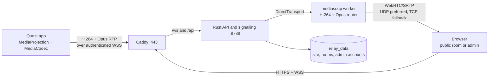

# How QuestRelay works

QuestRelay is a single-server live media relay. A Quest companion app captures the headset display and eligible playback audio, a Rust service routes the encoded tracks, and browsers subscribe to the feeds they choose

> [!NOTE]
> The current design aims for low latency, but glass-to-glass delay has not been measured. No networked video system can guarantee zero latency



## Pieces and ownership

| Piece | Owns | Main source |
| --- | --- | --- |
| Quest app | Capture consent, H.264 and Opus encoding, RTP packetisation, reconnection and local quality control | [`quest/app`](../quest/app/) |
| Rust service | Authentication, rooms, signalling, live feed registry and diagnostics | [`backend/src`](../backend/src/) |
| mediasoup worker | Producers, consumers and WebRTC transports; it forwards encoded tracks without decoding or mixing them | [`backend/src/relay.rs`](../backend/src/relay.rs) |
| Browser app | Public viewing, admin controls, per-feed subscriptions and playback stats | [`frontend/src`](../frontend/src/) |
| Caddy and Compose | HTTPS, static web files, API/WebSocket proxy and persistent volumes | [`tools/config/Caddyfile`](../tools/config/Caddyfile), [`tools/config/compose.yaml`](../tools/config/compose.yaml) |

The archived ADB/scrcpy prototype in [`quest/prototype-server`](../quest/prototype-server/) does not forward media for this path

## A viewer joining a room

1. The browser loads `/livestream/<id>` and reads that room's public settings from `/api/livestream/{id}`
2. It posts an access code when required to `/api/livestream/{id}/ticket`; the server issues a single-use ticket that expires after 30 seconds
3. The browser opens `/ws/relay`, redeems the ticket, and receives the feed list and RTP capabilities
4. `mediasoup-client` creates a receive transport; the viewer subscribes only to selected video and audio producers
5. Pinning, layout, muting and theme preferences affect that browser's presentation; unwatching releases the feed's consumers

The main lounge can show several headsets. Each connected headset also gets a separate six-character feed-room link and its own access and appearance settings. Room access is checked again when it changes so an existing viewer cannot keep a revoked subscription

## Trust and state

| Boundary | Control | Persistence |
| --- | --- | --- |
| Quest publisher | Distinct publisher key, headset ID validation, headset-count limit and bounded WebSocket frames | Key comes from the server environment; the app stores its copy in Android Keystore |
| Public viewer | Public room or private access code, rate-limited ticket issue, single-use short-lived ticket and viewer-count limit | Room settings survive restarts; tickets and connections do not |
| Admin | Admin key or WebAuthn passkey, session cookie, owner-only account management | Admin accounts and passkeys survive restarts; sessions, challenges and invites do not |
| Media | WebRTC/SRTP from relay to browser on UDP/TCP 44444 | Live tracks and recent diagnostics stay in memory |

Site, feed-room and admin-account JSON files live in the `relay_data` volume. Updates use a temporary file and atomic rename, with mode `0600` on Unix. Back up that volume and protect the three server keys; losing the volume loses room and passkey state

> [!IMPORTANT]
> The public HTTPS port is only part of the media route. Viewers must also reach the announced relay address on UDP or TCP 44444. There is no TURN service today, so some restrictive networks will fail even when the page and signalling work

## Latency and scale

The Quest encodes at the device's supported resolution and frame rate, sends RTP packets inside WSS/TCP, and drops queued video when the socket falls behind. The service feeds those packets into mediasoup; browsers receive WebRTC media directly. TCP loss on the Quest-to-relay leg can hold newer packets behind a missing one. The relay does not transcode, composite or record

Auto quality uses the counts of active publishers and viewers plus the configured egress budget to choose an encoder bitrate. It is a heuristic, not a measured network-capacity guarantee. A useful first estimate for relay egress is:

```text
sum of (each feed's encoded bitrate × viewers receiving that feed)
```

Transport overhead, audio, retransmissions and control traffic add to that estimate. `QUESTRELAY_MAX_HEADSETS` defaults to 8 and `QUESTRELAY_MAX_VIEWERS` to 64, but those are admission limits rather than proven capacity. The service currently has one mediasoup worker, one in-memory live registry and local JSON state, so a second server cannot simply be added behind a load balancer

The admin's control RTT, packet counts, bitrate, queue and recent uptime samples help isolate capture or transport faults. The browser also reads WebRTC connection statistics. Neither value is glass-to-glass delay; that needs a clock-in-frame or comparable end-to-end measurement

<details>
<summary>What still needs a real-device test</summary>

- [x] One Quest sends video and an audio track to a local browser
- [ ] Audible game audio, sync and capture permission across representative Quest titles
- [ ] Several headsets and viewers at once, with an egress and CPU load profile
- [ ] Internet viewing across home, mobile and restrictive NATs
- [ ] Capture-to-display latency distributions on LAN and a nearby WAN relay
- [ ] Signed Quest release build and normal release-channel installation

</details>

For commands and deployment ports, see the [README](../README.md#deploy)
